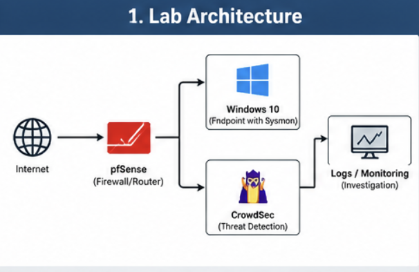
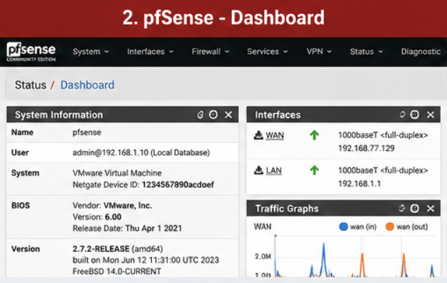
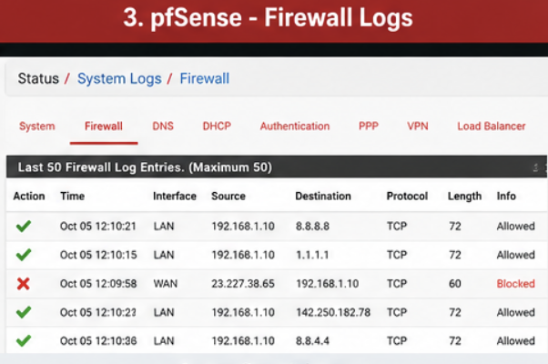
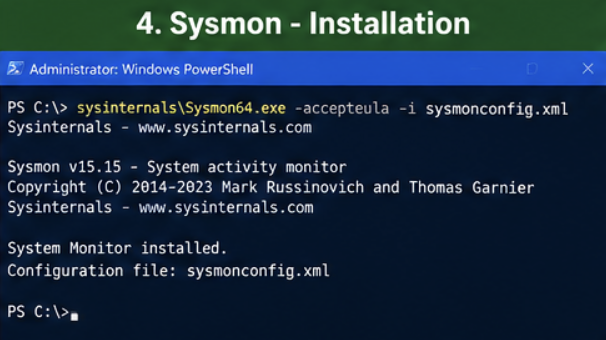
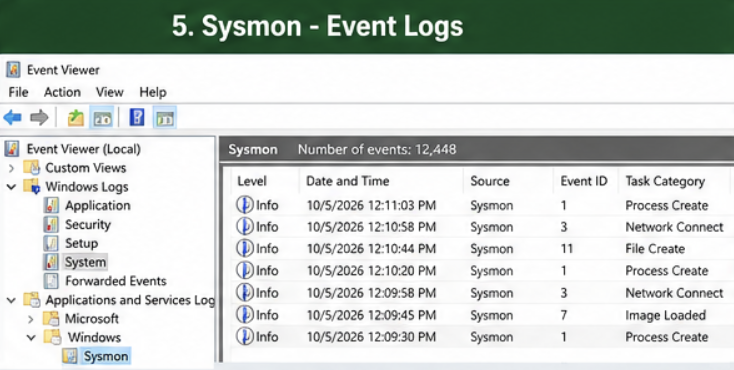
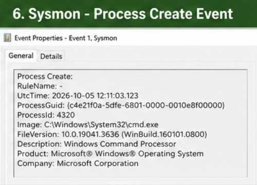
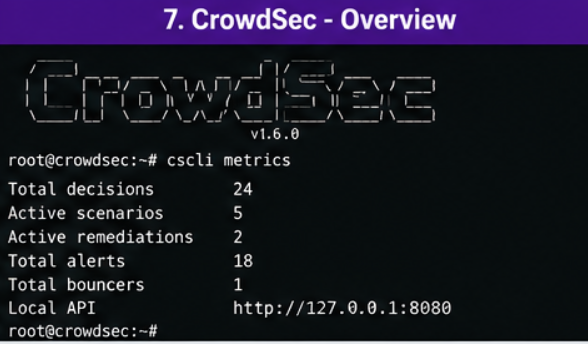
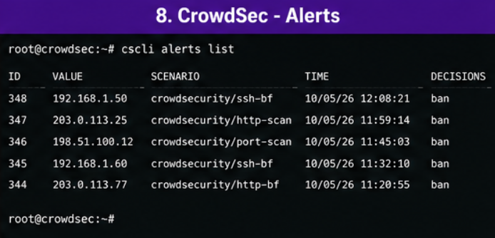
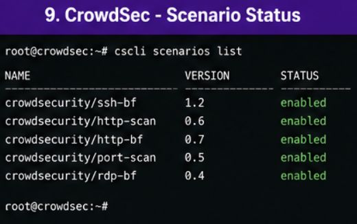

# Lab Screenshots & Visual Documentation

## Overview

This directory contains visual documentation related to the SOC Home Lab.

The original lab environment is no longer available locally, so historical screenshots from the original environment could not be recovered.

To avoid presenting recreated material as historical evidence, the visual references in this section are clearly identified as **illustrative representations** of the lab components and investigation workflow.

---

## 1. Lab Architecture

### Architecture Overview



**Description:**  
Illustrative representation of the SOC home lab architecture showing network security, endpoint telemetry, threat detection, and investigation components.

---

## 2. pfSense

### pfSense Dashboard



**Description:**  
Illustrative representation of a pfSense dashboard used for network and firewall visibility.

### pfSense Firewall Logs



**Description:**  
Illustrative representation of firewall log information that can be reviewed during network security investigations.

---

## 3. Sysmon

### Sysmon Installation



**Description:**  
Illustrative representation of Sysmon installation and endpoint monitoring setup.

### Sysmon Event Logs



**Description:**  
Illustrative representation of Sysmon events available for endpoint investigation.

### Sysmon Process Creation Event



**Description:**  
Illustrative representation of endpoint process creation telemetry used during security investigation.

---

## 4. CrowdSec

### CrowdSec Overview



**Description:**  
Illustrative representation of CrowdSec security monitoring and threat detection information.

### CrowdSec Alerts



**Description:**  
Illustrative representation of CrowdSec alerts generated during security monitoring.

### CrowdSec Scenario Status



**Description:**  
Illustrative representation of enabled CrowdSec detection scenarios.

---

## 5. Visual Investigation Workflow

The visual references correspond to the main components documented throughout this repository:

```text
                    SOC Home Lab
                         |
        +----------------+----------------+
        |                |                |
        v                v                v
     pfSense           Sysmon          CrowdSec
        |                |                |
        v                v                v
 Network Evidence   Endpoint Data   Threat Detection
        |                |                |
        +----------------+----------------+
                         |
                         v
                 Evidence Correlation
                         |
                         v
                   Investigation
                         |
                         v
                    IOC Analysis
```

---

## 6. Screenshot Categories

| Category | Visual Reference |
|---|---|
| Architecture | Lab topology |
| Network Security | pfSense dashboard and firewall logs |
| Endpoint Security | Sysmon installation and events |
| Threat Detection | CrowdSec monitoring and alerts |
| Investigation | Endpoint and network evidence |

---

## Important Note

The visuals in this directory are **illustrative reference images** created to communicate the architecture and workflow of the project.

They are **not claimed to be historical screenshots from the original lab environment**.

No fabricated screenshots are presented as actual historical evidence.

If original screenshots from the lab are recovered in the future, they can replace the illustrative references.
